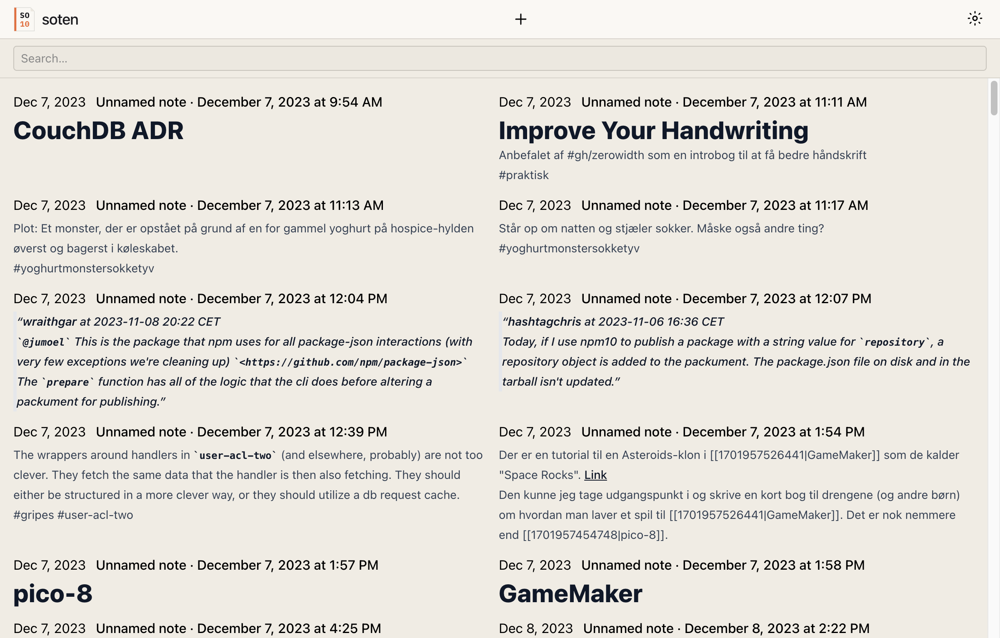
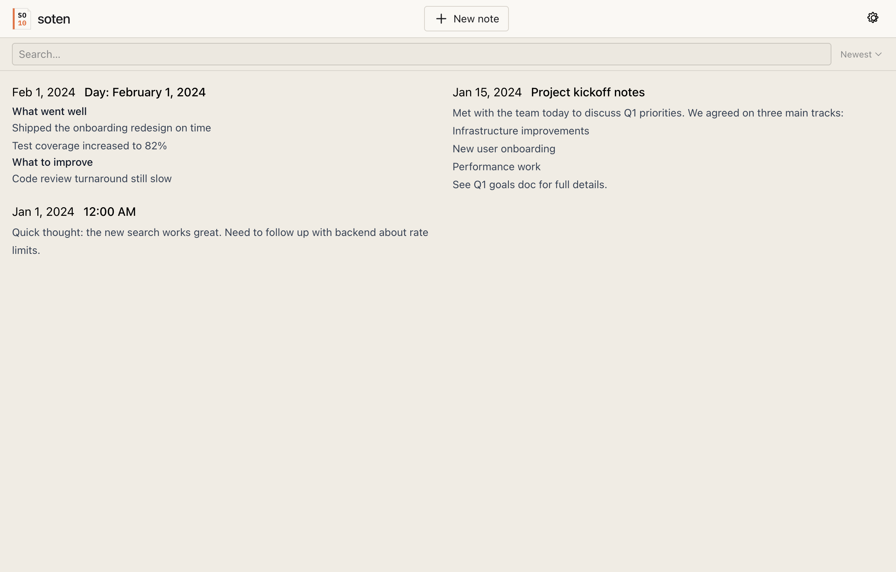
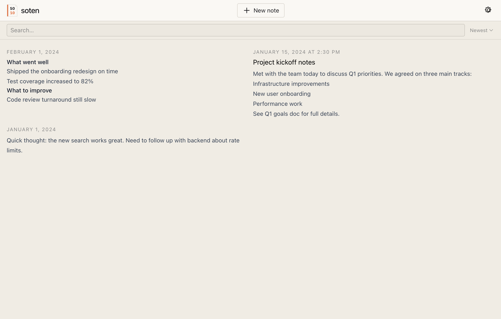
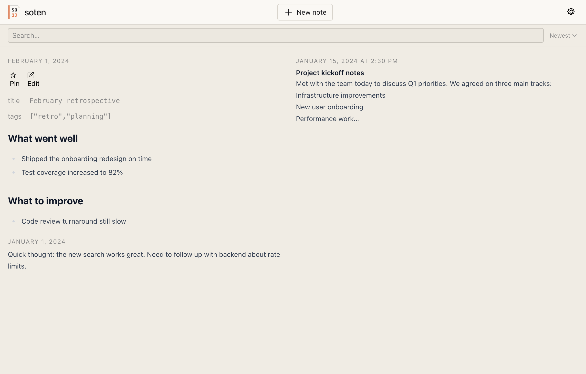
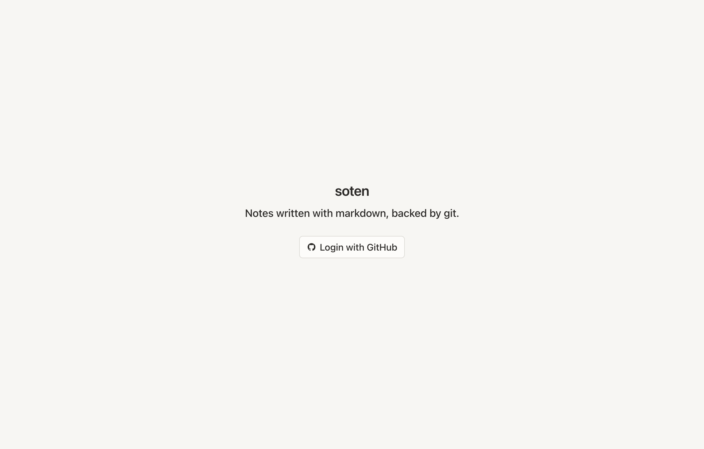
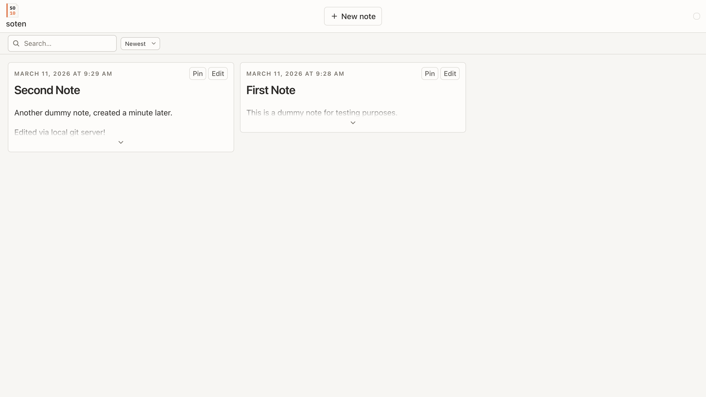
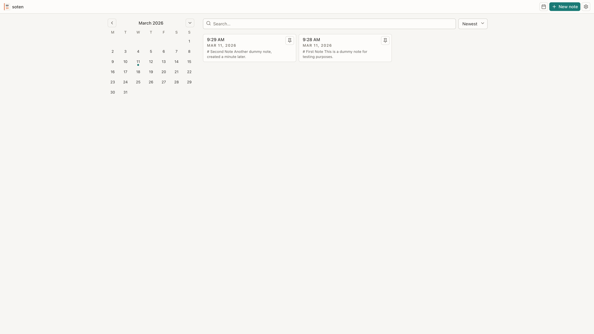
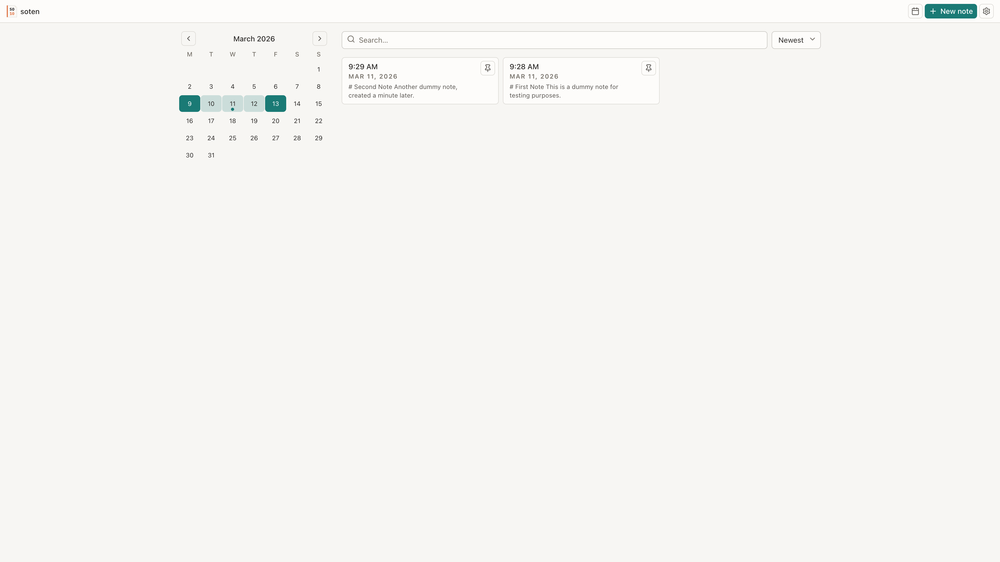

# Build Log

Chronological record of significant changes. See CLAUDE.md for the log format.

---

### 2026-03-08 — Add local repo dev mode

Added a dev-only `?localRepo=<path>` URL parameter that loads a local git repository into the
app without GitHub authentication. Enables automated testing via Chrome DevTools MCP. Files are
served by a Vite plugin middleware (`/api/test-repo/*`) and written into LightningFS via a new
`populateFiles` worker message.

### 2026-03-08 — Add five-phase redesign plan

Added `plans/01` through `plans/05` covering the full redesign: layout overhaul, new note
creation with git-backed draft branches, existing note editing, draft recovery on reopen, and
sync indicators with auto-push.

### 2026-03-08 14:00 — Full app redesign: layout, drafts, editing, recovery, sync

Implemented all five redesign phases in one pass. The note list view was replaced with a full-height
split layout: a reference panel (search + note cards) on the left and an editor pane on the right
for wide viewports, collapsing to a single pane on narrow screens. Notes are now edited on git
draft branches and squash-merged to main on save. Drafts survive page reloads via branch recovery.
A git working spinner and auto-push on save complete the sync story.

### 2026-03-08 — Fix: save works without a git remote

Added `hasRemote()` to the worker protocol so the app can detect whether the cloned repository
has a configured remote. The ready-phase machine state now carries this flag, and `pushIfOnline()`
returns early when it is false. The local-repo dev path hard-codes `hasRemote: false`. Saves to
`?localRepo=` repos now commit locally and never attempt a push that would error.

### 2026-03-08 — UX polish: titles, wikilinks, frontmatter, editor buttons, sort, empty states

Several UX improvements landing together. Timestamp-named notes now show just the time in the
card header (the date column already provides context). Notes with an H1 use that heading as
the card title and strip it from the preview body. Wikilinks (`[[target|label]]`) render as styled
spans rather than raw bracket text. YAML frontmatter no longer leaks into the rendered note view.
The editor toolbar gains visual hierarchy: Save is `secondary`, Discard is red, and confirming a
discard is now inline rather than a browser `confirm()` dialog. The gear menu is refactored to
use `DividedList` for consistent item styling. Empty note lists and empty search results now show
informative placeholder text. Notes sort newest-first by default with a sort control (Newest /
Oldest / Best match) in the panel header. The search input gains `id` and `name` attributes for
accessibility.

### 2026-03-08 — Restore vertical card layout

Reverted the note card layout to a vertical stack: full date/datetime at top in meta style,
H1 heading below (when present), preview text after. Date-only files show just the date;
timestamp files show the full datetime including time.

### 2026-03-09 — Card and expand redesign

Removed duplicate content and expand inconsistency. Card preview now shows the raw body (no H1 stripping); expanded state renders inline inside the card with Pin/Edit buttons, replacing the separate `NoteExpanded` component. `NoteFullContent` is a new shared component used by both `NoteRow` and `PinnedNote`.

### 2026-03-09 — Design system migration: replace ds/ with design/

Migrated all components from the old `src/components/ds/` layer to the consolidated `src/design/`
system. The legacy `ds/` directory (19 files) and thin wrapper components (`AlertBox`, `Button`,
`ProseContent`, `PageContainer`, `BackLink`) were deleted. All handrolled SVG icons replaced with
lucide-react; GitHub icon kept as inline SVG since lucide removed brand icons. Design components
now reject `className` via TypeScript. All user-visible strings migrated to the i18n system.
`DataTable` and `Stack direction` support were added to the design system to cover gaps.

### 2026-03-11 — Move domain logic into web worker as atomic operations

Moved all git domain operations (autosave, publish, discard, sync, clone) into the web worker
behind a serial promise queue. The main thread no longer touches git directly - it sends
high-level commands and receives complete state snapshots back. No-checkout commits via tree/blob
APIs eliminate working tree churn during autosave. Draft branch deletion is now pushed to the
remote on save, fixing the bug where edits on one device didn't appear on another. The old
primitive worker methods, `git-status.ts`, `push.ts`, and `draft-recovery.ts` were removed.

### 2026-03-11 — Rebuild design system as src/ds/

Deleted the old `src/design/` directory and rebuilt the design system from scratch in `src/ds/`
with 17 primitives: Box, Stack, Grid, Divider, Spacer, Text, Button, IconButton, Link, Input,
Textarea, SearchField, Toggle, Alert, Badge, Spinner, Dialog, Card, and Icon. Each component has
Storybook stories covering all variants and states. New components (IconButton, Input, Toggle,
Badge, Spinner, Dialog, Card, Divider, Spacer) fill gaps the old system had. Icon set expanded
with settings, pin, file-text, clock, grip-vertical, moon, sun, log-out, refresh-cw, wifi-off,
and upload. All consumer imports updated.

### 2026-03-11 — Replace state layer with domain atoms and hash router

Deleted the entire old `src/atoms/` state machine and all feature components. Replaced with
domain-organized Jotai atoms in `src/state/` (auth, repo, ui) where write atoms handle side
effects directly instead of a central dispatch system. Removed @tanstack/react-router in favor
of a hash-based router in `src/lib/router.ts`. Minimal auth shell handles login, OAuth callback,
repo selection, clone, and ready state using only design system primitives.

### 2026-03-11 — Browser view with calendar, search, and note cards

Built the BrowserView with a three-panel layout: calendar grid (left), note list (center), and
search (top). Notes display as cards with title, date, and preview snippet. Calendar highlights
days with notes. Search uses the worker's MiniSearch index with relevance scoring. Pin/unpin
support via localStorage. All strings go through the i18n system.

### 2026-03-11 — Review fixes: Select component, i18n coverage, configurable week start

Created a proper ds/Select component to replace raw HTML selects. Added i18n coverage for all
remaining hardcoded strings. Made calendar week start day configurable (Monday default) via
settings. Added a unified `npm run dev` script that runs both Vite and Wrangler with color-coded
interleaved logging.

### 2026-03-12 — Editor view with auto-save, publish, backlinks, and offline support

Added the full note editor with a monospace textarea and 2-second debounced autosave to draft
branches. Publish and discard draft workflows with confirmation dialog. Backlinks panel scans all
notes for `[[title]]` wikilinks and shows matched notes as cards. SplitPane component provides a
draggable horizontal divider between editor and backlinks on tablet+. Mobile gets a stacked
layout. SyncIndicator shows save/sync/offline status. Editor atoms in `src/state/editor.ts`
track content, saved state, and dirty flag. Sync listeners in `src/state/sync.ts` handle
online/offline events, visibility changes, and periodic 5-minute sync.

### 2026-03-12 — Reference stack, overlay, vertical split pane, and conflict resolution

Desktop editor gains a two-column layout with a vertical SplitPane: editor+backlinks on the
left, reference search+card stack on the right. Tablet uses a slide-in Overlay for the same
reference panel. New components: NoteCardCondensed (compact search result), ReferenceCard
(collapsed/excerpt/expanded modes with rendered markdown), Overlay (right-edge slide-in with
swipe-to-dismiss), ReferencePanel (search + card stack). Backlink clicks route per breakpoint:
desktop adds to stack, tablet opens overlay, mobile navigates. Cmd+K focuses the reference
search on desktop and opens the overlay on tablet. Conflict detection compares local vs remote
trees when sync pull fails, showing the remote version as a ReferenceCard (desktop/tablet) or
an expandable Alert (mobile). Conflict badges appear on NoteCards in the browser view.

### 2026-03-12 — Ultra-wide three-column layout

At 1920px+ the editor view gains a third column: a condensed note browser (BrowserMini) on the
left with its own independent search and calendar, the editor+backlinks in the center, and the
reference panel on the right. Nested vertical SplitPanes with pointer-capture drag handles let
users resize all three columns. Shared calendar hooks extracted from BrowserView and BrowserMini
into `src/hooks/useCalendar.ts` to eliminate duplication. Cmd+K focuses reference search on
both desktop and ultra-wide breakpoints.

### 2026-03-12 — Side-by-side calendar in browser view, larger reference panel

Browser view now shows the calendar as a sticky sidebar alongside the note grid on xl+ screens
(1280px+), stacked above on smaller screens. Calendar defaults to open on desktop-sized windows.
Editor view reference panel gets more space: desktop ratio changed from 60/40 to 50/50, ultra-wide
inner ratio from 65/35 to 55/45.

### 2026-03-12 — Fresh load performance and calendar drag-to-select range

Fresh load performance improved ~40% by skipping a costly cold IndexedDB probe on first clone
and deferring the main-thread LightningFS lock. The app shell now renders immediately while the
clone runs in the background. Calendar supports drag-to-select date ranges - endpoint days get
full accent highlight, interior days get a lighter tint. Note list filters to the selected range.

